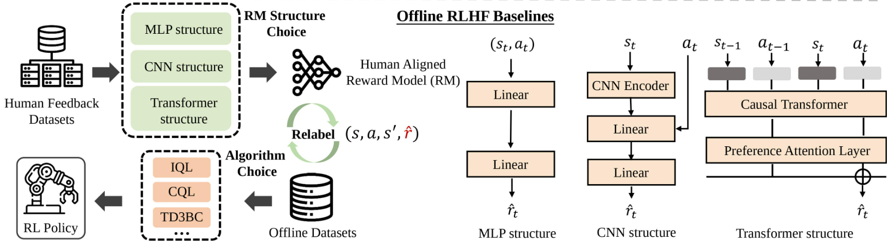

# Clean-Offline-RLHF

<p align="center">
<a href="https://uni-rlhf.github.io/">Project Website</a>
·
<a href="https://arxiv.org/abs/2402.02423">Paper</a>
·
<a href="">Platform</a>
·
<a href="https://drive.google.com/drive/folders/1JMWyl0iAm2JJ5pOBW5M9kTOj6pJn8H3N?usp=drive_link">Datasets</a>
·
<a href="https://github.com/TJU-DRL-LAB/Uni-RLHF">Clean Offline RLHF</a>
</p>

This is the official PyTorch implementation of the paper "[Uni-RLHF: Universal Platform and Benchmark Suite for Reinforcement Learning with Diverse Human Feedback](https://arxiv.org/abs/2402.02423)". Clean-Offline-RLHF is an Offline Reinforcement Learning with Human Feedback codebase that provides high-quality and realistic human feedback implementations of offline RL algorithms. 
<p align="center">
    <br>
    
    <br>
<p>

## 💡 News

- **[03-26-2024]** 🔥 Update Mini-Uni-RLHF, a minimal out-of-the-box annotation tool for researchers, powered by [streamlit](https://streamlit.io/).  
- **[03-24-2024]** Release of [SMARTS](https://github.com/huawei-noah/SMARTS) environment training dataset, scripts and labels. You can find it 
in the [smarts branch](https://github.com/pickxiguapi/Clean-Offline-RLHF/tree/smarts).
- **[03-20-2024]** Update detail setup bash files.  
- **[02-22-2024]** Initial code release.    


## 🛠️ Getting Started

Clone this repository.
```bash
git clone https://github.com/pickxiguapi/Clean-Offline-RLHF.git
cd Clean-Offline-RLHF
```
Install PyTorch & torchvision.
```bash
pip3 install torch torchvision --index-url https://download.pytorch.org/whl/cu118
```
Install extra dependencies.
```bash
pip install -r requirements/requirements.txt
```

## 💻 Usage

### Human Feedback

Before using offline RLHF algorithm, you should annotate your dataset using human feedback. If you wish to collect labeled dataset to new tasks, we refer to [platform]() part for crowdsourced annotation. Here, we provide a ~15M steps crowdsourced annotation dataset for the sample task. [raw dataset](https://drive.google.com/drive/folders/1JMWyl0iAm2JJ5pOBW5M9kTOj6pJn8H3N?usp=drive_link). 

The processed crowdsourced (CS) and scripted teacher (ST) labels are located at [crowdsource_human_labels](crowdsource_human_labels/) and [generated_fake_labels](generated_fake_labels/) folders.

Note: for comparison and validation purposes, we provide fast track for scripted teacher (ST) label generation in `fast_track/generate_d4rl_fake_labels.py`.

### Pre-train Reward Models

Here we provided an example of `CS-MLP` method for `walker2d-medium-expert-v2` task, and you can customize it in configuration file `rlhf/cfgs/default.yaml`.
```bash
cd rlhf
python train_reward_model.py domain=mujoco env=walker2d-medium-expert-v2 \
modality=state structure=mlp fake_label=false ensemble_size=3 n_epochs=50 \
num_query=2000 len_query=200 data_dir="../crowdsource_human_labels" \
seed=0 exp_name="CS-MLP"
```

For more environment of reward model training, we provide the bash files:
```bash
cd rlhf
bash scripts/train_mujoco.sh
bash scripts/train_antmze.sh
bash scripts/train_adroit.sh
```

### Train Offline RL with Pre-trained Rewards 

Following Uni-RLHF codebase implemeration, we modified `IQL`, `CQL` and `TD3BC` algorithm.

Example: Train `IQL` with `CS-MLP` reward model. The log will be uploaded to [wandb](https://wandb.ai/site).
```bash
python algorithms/offline/iql_p.py --device "cuda:0" --seed 0 \
--reward_model_path "path/to/reward_model" --config_path ./configs/offline/iql/walker/medium_expert_v2.yaml \
--reward_model_type mlp --seed 0 --name CS-MLP-IQL-Walker-medium-expert-v2
```

You can have any combination of algorithms, label types and reward model types:

| Algorithm | Label Type | Reward Model Type |
|-----------|------------|-------------------|
| IQL       | CS         | MLP               |
| CQL       | ST         | TFM               |
| TD3BC     |            | CNN               |


For more environment of policy training, we provide the bash files:
```bash
bash scripts/run_mujoco.sh
bash scripts/run_antmze.sh
bash scripts/run_adroit.sh
```

<!-- LICENSE -->
## 🏷️ License

Distributed under the MIT License. See `LICENSE.txt` for more information.

<!-- CONTACT -->
## ✉️ Contact

For any questions, please feel free to email yuanyf@tju.edu.cn.

<!-- CITATION -->
## 📝 Citation

If you find our work useful, please consider citing:
```
@inproceedings{anonymous2023unirlhf,
    title={Uni-{RLHF}: Universal Platform and Benchmark Suite for Reinforcement Learning with Diverse Human Feedback},
    author={Yuan, Yifu and Hao, Jianye and Ma, Yi and Dong, Zibin and Liang, Hebin and Liu, Jinyi and Feng, Zhixin and Zhao, Kai and Zheng, Yan}
    booktitle={The Twelfth International Conference on Learning Representations, ICLR},
    year={2024},
    url={https://openreview.net/forum?id=WesY0H9ghM},
}
```

